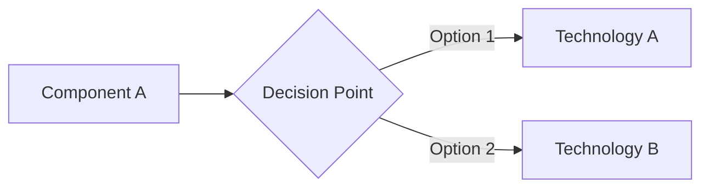

# Decision 001: Example Architecture Council Session

- **Date**: 2024-02-07
- **Council**: Architecture Council
- **Status**: Example Template

> [!NOTE]
> This is a template showing how to document council decisions. Copy this format for real decisions.

## Question

Should we use [Technology A] or [Technology B] for [specific use case]?

## Context

- **Current situation**: [Describe what exists now]
- **Requirements**: [What we need to achieve]
- **Constraints**: [Time, budget, technical limitations]
- **Options considered**: [Technology A, Technology B, and why these two]

<!-- Include a mermaid diagram when the decision involves multiple components or data flows -->

## Council Votes

### Principal Engineer (consult: full-stack-orchestration)

- **Vote**: ☐ Approve [A] ☐ Approve [B] ☐ Concern ☐ Block
- **Rationale**: [2-3 sentences on architectural soundness, scalability, maintainability]
- **Recommendations**: [Changes needed, trade-offs to consider]

### Platform Engineer (consult: cloud-infrastructure)

- **Vote**: ☐ Approve [A] ☐ Approve [B] ☐ Concern ☐ Block
- **Rationale**: [Infrastructure and deployment assessment, operational complexity]
- **Recommendations**: [Operational concerns, monitoring needs, deployment strategy]

### Security Engineer

- **Vote**: ☐ Approve [A] ☐ Approve [B] ☐ Concern ☐ Block
- **Rationale**: [Security risks, compliance considerations, attack surface]
- **Recommendations**: [Security improvements, hardening steps, audit requirements]

### Backend Specialist (consult: backend-development)

- **Vote**: ☐ Approve [A] ☐ Approve [B] ☐ Concern ☐ Block
- **Rationale**: [API/database design evaluation, developer experience, ecosystem]
- **Recommendations**: [Technical implementation concerns, integration challenges]

## Decision

- **Status**: ☐ Approved ☐ Needs Changes ☐ Blocked
- **Choice**: [Technology A / Technology B]
- **Consensus**: [Summary of agreement/disagreement across council members]

## Rationale Summary

[2-3 paragraphs synthesizing the council's perspectives into a cohesive decision rationale]

**Key factors**:

- [Factor 1 from multiple perspectives]
- [Factor 2 that emerged as critical]
- [Trade-offs accepted and why]

## Action Items

- [ ] **[Owner]**: [Specific action with clear acceptance criteria]
- [ ] **[Owner]**: [Implementation task]
- [ ] **[Owner]**: [Documentation or testing requirement]
- [ ] **[Owner]**: [Follow-up review or validation]

## Timeline

- **Decision Date**: 2024-02-07
- **Implementation Start**: [Date]
- **Expected Completion**: [Date]
- **Review Checkpoint**: [Date for follow-up evaluation]

## Follow-up

[What needs to be validated after implementation? When should we revisit this decision?]

## References

- [Link to relevant documentation]
- [Link to research or comparison]
- [Link to related decisions]

---

## How to Use This Template

1. **Copy this file** to a new file: `NNN-short-title.md` (e.g., `002-database-choice.md`)
2. **Fill in the Question and Context** sections before activating the council
3. **Activate the council** in Claude Code with your question
4. **Paste each council member's response** into their respective vote sections
5. **Synthesize the decision** in the Decision and Rationale Summary sections
6. **Create action items** with clear owners and acceptance criteria
7. **Track progress** by checking off action items as they're completed
8. **Review and update** if circumstances change or new information emerges

> [!TIP]
> **GFM features to use in decision records:**
>
> - **GitHub alerts** (`> [!NOTE]`, `> [!WARNING]`, etc.) for callouts instead of bold emphasis
> - **Mermaid diagrams** for architecture visualizations when multiple components or data flows are involved
> - **Collapsible `
` sections** for lengthy council evaluations
> - **Tables** for structured comparisons of options
>
> See `.claude/CLAUDE.md` for full GFM formatting guidelines.

## Example Real Decision

See [002-plugin-selection.md](./002-plugin-selection.md) for a real council decision example.
