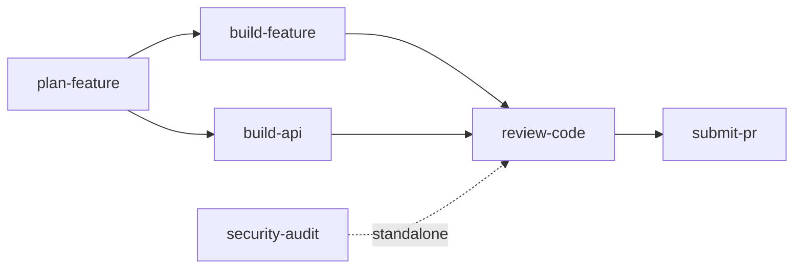

# Agent Council

Structured development workflows powered by councils of specialized AI agents. Plan features, implement code, review changes, and submit PRs — all with multi-perspective evaluation from 11 agent personas organized into 5 councils.

## What You Get

**6 Skills** — executable workflows for every phase of development:

| Skill | What it does |
|-------|-------------|
| plan-feature | Council-evaluated feature planning with decision records |
| build-feature | Full-stack implementation (DB + API + UI + tests) |
| build-api | Backend-only API and database development |
| review-code | Security scanning + 4-member Review Council |
| submit-pr | Quality checks, PR creation, CI monitoring |
| security-audit | SAST + STRIDE threat modeling + attack trees |

**5 Councils** — multi-perspective evaluation groups:

| Council | Members | Evaluates |
|---------|---------|-----------|
| Product | 6 agents | Feature scope, priority, user value |
| Feature | 4 agents | Technical planning, task breakdown |
| Architecture | 4 agents | API design, schema changes, patterns |
| Review | 4 agents | Code quality, security, documentation |
| Deployment | 3 agents | Release readiness, infrastructure |

**11 Agent Personas** — specialized perspectives including Principal Engineer, Security Engineer, QA Lead, Frontend/Backend Specialists, and more.

## Installation

```bash
npx skills add andrewvaughan/agent-council
```

This installs skill workflows, agent definitions, and council templates into your project's skills directory. Each skill is self-contained with its own bundled agents and councils.

### Post-Install

Point your AI agent to `AGENTS.md` in the installed package for full instructions on how to use the skills and councils.

## Quick Demo

Here's what a typical workflow looks like:

**1. Plan the feature**

Tell your agent to run the `plan-feature` skill with a description. The Product Council (6 members) evaluates scope and priority, then the Feature Council (4 members) creates a technical plan. You approve at each checkpoint.

**2. Build it**

Run `build-feature` with the issue number from step 1. The agent implements across all layers — database, API, frontend, tests — with checkpoints for schema approval and API contract review.

**3. Review and submit**

Run `review-code` for a 4-member council review with automated security scanning. Then `submit-pr` to create a pull request with quality checks and optional deployment council review.

## How It Works



Each skill activates the appropriate council at decision points. Council members are AI agent personas with specialized focus areas (security, quality, architecture, etc.) that vote Approve, Concern, or Block on proposals. This ensures every significant decision gets multi-perspective evaluation before proceeding.

Skills enforce strict boundaries — each owns a specific phase and hands off to the next. This prevents scope creep and keeps the human in control at every checkpoint.

## Agent Compatibility

| Agent | Support | Notes |
|-------|---------|-------|
| Claude Code | Full | Native skill support, slash commands, Task subagents |
| Cursor | Partial | Load AGENTS.md as context, invoke skills manually |
| Codex CLI | Partial | Reference AGENTS.md, follow skill steps manually |
| Other agents | Manual | Any agent that reads markdown can follow the workflows |

Skills are written as structured markdown workflows. Any AI coding agent that can read files and follow instructions can use them — full automation depends on the agent's capabilities.

## Customization

Tailor the workflows to your project:

- **Add an agent**: Create a new `.md` file in `canonical/agents/` following the existing format
- **Modify a council**: Edit the council template in `canonical/councils/` to add or remove members
- **Customize a skill**: Edit the workflow in `canonical/skills/` and run `scripts/build.sh` to regenerate

See [CONTRIBUTING.md](CONTRIBUTING.md) for full details.

## Documentation

- [AGENTS.md](AGENTS.md) — Full reference for AI agents (skills, councils, agents, rules)
- [CONTRIBUTING.md](CONTRIBUTING.md) — How to add skills, agents, and councils

## Contributing

We welcome contributions! See [CONTRIBUTING.md](CONTRIBUTING.md) to get started.

## License

[MIT](LICENSE)

## Acknowledgments

- [wshobson/agents](https://github.com/wshobson/agents) — MIT-licensed agent plugins that inspired the inline guidance pattern
- [skills.sh](https://skills.sh) — The open agent skills ecosystem
- [Council pattern](https://www.theengineeringmanager.com/growth/councils-of-agents-group-thinking-with-llms/) — Group thinking with LLMs
