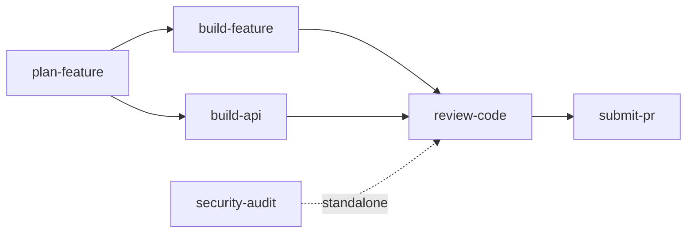

# Agent Council

**Ship better code by replacing single-agent guesswork with structured, multi-perspective AI workflows.**

When a single AI agent plans, builds, and reviews its own code, blind spots compound. Agent Council fixes this by organizing 11 specialized agent personas into 5 councils — each bringing a distinct perspective (security, architecture, quality, operations, user experience) to every significant decision. The result: fewer missed edge cases, stronger security posture, and production-ready code that's been evaluated from multiple angles before it ever reaches a pull request.

> [!TIP]
> **New to council-driven development?** Jump to [Why Councils?](#why-councils) to understand the approach, or skip straight to [Installation](#installation) to try it.

## Skills

Six executable workflows covering the full development lifecycle:

| Skill | Phase | What it does |
|-------|-------|-------------|
| `plan-feature` | Plan | Product Council evaluates scope and priority; Feature Council produces a technical plan with decision records |
| `build-feature` | Build | Full-stack implementation across database, API, frontend, and tests — with user checkpoints at every layer |
| `build-api` | Build | Backend-focused API and database development; activates Architecture Council for significant API decisions |
| `review-code` | Review | Automated SAST scanning + 4-member Review Council for security, quality, documentation, and domain review |
| `submit-pr` | Ship | Pre-submission quality checks, PR creation with conventional formatting, and CI pipeline monitoring |
| `security-audit` | Audit | SAST + STRIDE threat modeling + attack tree analysis — standalone or as part of the review pipeline |

## Councils

Councils are groups of agent personas that evaluate proposals through structured voting. Each member votes **Approve**, **Concern**, or **Block** with rationale — surfacing risks and trade-offs that a single perspective would miss.

| Council | Members | When it activates |
|---------|---------|-------------------|
| Product | 6 agents | Feature planning — evaluates scope, priority, and user value |
| Feature | 4 agents | Technical planning — breaks down implementation and identifies risks |
| Architecture | 4 agents | API design — reviews schema changes, patterns, and scalability |
| Review | 4 agents | Code review — assesses security, quality, testing, and documentation |
| Deployment | 3 agents | PR submission — checks release readiness and infrastructure impact |

## Agent Personas

Eleven specialized perspectives that staff the councils:

| Agent | Focus |
|-------|-------|
| Principal Engineer | Architecture, system design, cross-cutting concerns |
| Security Engineer | OWASP, threat modeling, auth, secrets management |
| QA Lead | Test strategy, coverage, edge cases, regression |
| Frontend Specialist | Components, accessibility, state management, UX |
| Backend Specialist | API design, services, data access, performance |
| Platform Engineer | Infrastructure, deployment, monitoring, reliability |
| DevX Engineer | Documentation, developer experience, onboarding |
| Product Manager | User value, scope, prioritization, success metrics |
| Technical Writer | Clarity, completeness, audience-appropriate docs |
| UX Designer | Usability, interaction design, accessibility |
| Data Analyst | Metrics, analytics, data-driven decisions |

Each agent has complexity tiers (Standard and Advanced) that scale review depth based on the significance of the decision.

## Why Councils?

A single AI agent reviewing its own work is like a developer merging their own PRs without review — it works until it doesn't. Council-driven development addresses three fundamental problems:

**Perspective diversity.** A security engineer spots injection risks that a frontend specialist wouldn't flag. A QA lead identifies untested edge cases that a backend developer considers obvious. By routing decisions through multiple specialized perspectives, councils catch the issues that single-agent workflows systematically miss.

**Structured checkpoints.** Each skill enforces explicit approval gates — you approve the schema before migration runs, the API contract before frontend builds against it, the review findings before they're committed. The AI proposes; you decide. This keeps the human in control without requiring you to micromanage every line.

**Audit trail.** Council evaluations, votes, and rationale are recorded in decision documents. When you revisit a feature six months later and wonder "why did we design it this way?", the council record has the answer — complete with trade-offs considered and alternatives rejected.



Skills enforce strict scope boundaries — each owns a single phase and hands off to the next. `build-feature` never creates a PR. `review-code` never pushes code. This prevents scope creep and makes each step independently auditable.

## Installation

```bash
npx skills add andrewvaughan/agent-council
```

This installs self-contained skill packages — each with its own bundled agent definitions and council templates — into your project's skills directory.

### Post-Install

Point your AI agent to `AGENTS.md` in the installed package for full instructions on available skills, councils, and agents.

### Configuring Your Tech Stack

Implementation skills (`build-feature`, `build-api`) are technology-agnostic — they adapt to whatever your project uses. Add a `## Tech Stack` section to your project's `AGENTS.md` so skills know what frameworks and tools to target:

```markdown
## Tech Stack

- Frontend: React with TypeScript
- Backend: Express with TypeScript
- ORM: Prisma with PostgreSQL
- UI: Tailwind CSS + shadcn/ui
- Validation: Zod
- Test runner: Vitest
- E2E: Playwright
- Package manager: npm
```

> [!NOTE]
> If the tech stack isn't defined, implementation skills will stop and ask you what your project uses before proceeding. They'll also suggest updating `AGENTS.md` when they introduce new technologies, so the stack definition stays current.

## Quick Start

**1. Plan** — Run `plan-feature` with a feature description. The Product Council (6 members) evaluates scope and priority, then the Feature Council (4 members) creates a technical implementation plan. You approve at each checkpoint.

**2. Build** — Run `build-feature` (full-stack) or `build-api` (backend-only) with the issue number from step 1. The agent implements across all layers with checkpoints for schema approval and API contract review.

**3. Review** — Run `review-code` for automated SAST scanning and a 4-member council review covering security, quality, testing, and documentation.

**4. Ship** — Run `submit-pr` to push, create a PR with conventional formatting, and monitor CI until green.

## Agent Compatibility

| Agent | Support | Notes |
|-------|---------|-------|
| Claude Code | Full | Native skill support, slash commands, Task subagents for parallel council evaluation |
| Cursor | Partial | Load AGENTS.md as context, invoke skill workflows manually |
| Codex CLI | Partial | Reference AGENTS.md, follow skill steps manually |
| Other agents | Manual | Any agent that reads markdown can follow the structured workflows |

Skills are plain markdown — no proprietary format, no runtime dependencies. Any AI coding agent that can read files and follow instructions can use them.

## Customization

Tailor the workflows to your project:

- **Add an agent** — Create a `.md` file in `canonical/agents/` following the existing persona format
- **Modify a council** — Edit the council template in `canonical/councils/` to add or remove members
- **Customize a skill** — Edit the workflow in `canonical/skills/` and rebuild

### Build System

All source content lives in `canonical/` — skill workflows, agent definitions, council templates, and shared templates. The build script reads `scripts/skill-manifest.json` to determine which agents, councils, and templates each skill needs, then assembles self-contained packages in `skills/`.

```bash
# Regenerate skills/ from canonical sources
scripts/build.sh

# Verify generated files match committed files (used by CI)
scripts/build.sh --check
```

After editing anything in `canonical/`, run `scripts/build.sh` to regenerate. The `--check` flag compares generated output against the committed `skills/` directory and reports any drift — CI runs this on every pull request.

> [!IMPORTANT]
> Never edit files in `skills/` directly — they are overwritten by the build. The `.claude/skills/` entries are symlinks to `skills/`, so editing through them also modifies generated files. Always edit sources in `canonical/`.

See [CONTRIBUTING.md](CONTRIBUTING.md) for full details on adding skills, agents, and councils.

## Documentation

| Document | Purpose |
|----------|---------|
| [AGENTS.md](AGENTS.md) | Full reference for AI agents — skills, councils, agents, configuration rules |
| [Skills Reference](docs/SKILLS-REFERENCE.md) | Detailed per-skill documentation with step summaries and example output |
| [Agent Compatibility](docs/AGENT-COMPATIBILITY.md) | Feature matrix and per-agent guidance for Claude Code, Cursor, Codex, and more |
| [Customization Guide](docs/CUSTOMIZATION.md) | How to adapt skills, agents, and councils for your project |
| [CONTRIBUTING.md](CONTRIBUTING.md) | How to add skills, agents, councils, and submit changes |
| [SECURITY.md](SECURITY.md) | Vulnerability reporting and security policy |

## Contributing

We welcome contributions! See [CONTRIBUTING.md](CONTRIBUTING.md) to get started.

## License

[MIT](LICENSE)

## Acknowledgments

- [skills.sh](https://skills.sh) — The open agent skills ecosystem
- [wshobson/agents](https://github.com/wshobson/agents) — MIT-licensed agent plugins that inspired the inline guidance pattern
- [Council pattern](https://www.theengineeringmanager.com/growth/councils-of-agents-group-thinking-with-llms/) — Group thinking with LLMs
