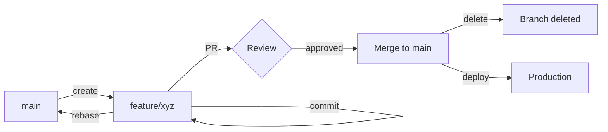

# Development Guide

This guide covers the development workflow, local setup, and best practices for Lawnsignal development.

## Prerequisites

- **Node.js** 22+ with pnpm
- **Docker** and Docker Compose
- **Git** with commit signing configured
- **GitHub CLI** (gh) for PR management

## Local Development Setup

### 1. Clone the Repository

```bash
git clone git@github.com:YOUR_USERNAME/lawnsignal.git
cd lawnsignal
```

### 2. Install Dependencies

```bash
# Install pnpm globally if not already installed
npm install -g pnpm

# Install project dependencies
pnpm install
```

### 3. Environment Configuration

```bash
# Copy example environment file
cp .env.example .env

# Edit .env with your local configuration
# (This file will be created when the monorepo is set up)
```

### 4. Start Development Environment

```bash
# Start all services (will be available when Docker Compose is configured)
docker-compose up -d

# Or start specific services
docker-compose up postgres -d

# Run development server
pnpm dev
```

## Development Workflow

### Trunk-Based Development

We follow **Trunk-Based Development** for rapid iteration and continuous delivery:

#### Core Principles

1. **Main is always production-ready**
   - Every commit to `main` can be deployed to production
   - All tests must pass before merging
   - No broken code in `main`

2. **Short-lived feature branches**
   - Create branch from `main`
   - Work for 1-3 days maximum
   - Merge back to `main` quickly
   - Delete branch after merge

3. **Frequent integration**
   - Rebase on `main` multiple times per day
   - Merge to `main` as soon as feature is complete
   - Don't let branches diverge from `main`

4. **Feature flags for incomplete work**
   - Use feature flags to hide work-in-progress
   - Merge incomplete features behind flags
   - Enable gradually in production

#### Daily Workflow

**Morning:**
```bash
# Start day with latest main
git checkout main
git pull origin main

# Create feature branch
git checkout -b feature/my-feature
```

**Throughout the day:**
```bash
# Commit frequently (atomic commits)
git add .
git commit -m "feat(scope): small incremental change"

# Rebase on main frequently (every few hours)
git fetch origin
git rebase origin/main

# Push to remote
git push origin feature/my-feature
```

**End of day (or when feature is done):**
```bash
# Final rebase
git fetch origin
git rebase origin/main

# Push and create PR
git push origin feature/my-feature
gh pr create --fill
```

### Feature Flags

For features that take > 1 day or aren't complete:

#### 1. Backend Feature Flags (NestJS)

```typescript
// feature-flags.service.ts
@Injectable()
export class FeatureFlagsService {
  isEnabled(flag: string): boolean {
    return process.env[`FEATURE_${flag}`] === 'true';
  }
}

// Usage in controller
if (this.featureFlags.isEnabled('NEW_AUTH')) {
  return this.newAuthService.authenticate(dto);
} else {
  return this.oldAuthService.authenticate(dto);
}
```

#### 2. Frontend Feature Flags (React)

```typescript
// useFeatureFlag.ts
export const useFeatureFlag = (flag: string): boolean => {
  return import.meta.env[`VITE_FEATURE_${flag}`] === 'true';
};

// Usage in component
function Dashboard() {
  const isNewDashboardEnabled = useFeatureFlag('NEW_DASHBOARD');

  return isNewDashboardEnabled ? <NewDashboard /> : <OldDashboard />;
}
```

#### 3. Environment Variables

```bash
# .env
FEATURE_NEW_AUTH=false
VITE_FEATURE_NEW_DASHBOARD=false
```

### Branch Lifecycle



## Project Structure

```
lawnsignal/
├── .claude/                    # Claude Code councils & agents
├── .github/                    # GitHub configs & templates
│   ├── workflows/              # GitHub Actions CI/CD
│   └── PULL_REQUEST_TEMPLATE.md
├── apps/                       # Applications (future)
│   ├── web/                    # React frontend
│   └── api/                    # NestJS backend
├── packages/                   # Shared packages (future)
│   ├── ui/                     # UI components
│   ├── types/                  # Shared types
│   └── utils/                  # Shared utilities
├── docs/                       # Documentation
├── CONTRIBUTING.md             # Contribution guidelines
└── README.md                   # Project overview
```

## Common Development Tasks

### Running Tests

```bash
# Run all tests
pnpm test

# Run tests in watch mode
pnpm test:watch

# Run tests with coverage
pnpm test:coverage

# Run E2E tests
pnpm test:e2e
```

### Linting and Formatting

```bash
# Lint code
pnpm lint

# Fix linting issues
pnpm lint:fix

# Format code with Prettier
pnpm format

# Type-check TypeScript
pnpm type-check
```

### Database Operations

```bash
# Run migrations
pnpm db:migrate

# Seed database
pnpm db:seed

# Reset database
pnpm db:reset

# Open Prisma Studio
pnpm db:studio
```

### Building

```bash
# Build all packages
pnpm build

# Build specific package
pnpm build --filter=@lawnsignal/web

# Build in watch mode
pnpm build:watch
```

## Debugging

### VS Code Debug Configuration

```json
// .vscode/launch.json
{
  "version": "0.2.0",
  "configurations": [
    {
      "type": "node",
      "request": "launch",
      "name": "Debug API",
      "runtimeExecutable": "pnpm",
      "runtimeArgs": ["--filter", "@lawnsignal/api", "start:debug"],
      "console": "integratedTerminal",
      "restart": true
    }
  ]
}
```

### Debugging Tips

1. **Use debugging-toolkit plugin** (installed with councils)
2. **Add breakpoints** in VS Code
3. **Use console.log** sparingly (prefer debugger)
4. **Check Docker logs**: `docker-compose logs -f service-name`

## Environment Management

### Current: Production Only

- **Main branch** → Deploys to production
- **Local development** → Docker Compose

### Future: Multiple Environments

When we add staging/beta, we'll implement:

1. **Environment branches** (optional)
   - `main` → Production
   - `staging` → Staging environment
   - `beta` → Beta/early access

2. **Deploy based on tags/releases**
   - Tag `v1.0.0` → Production
   - Tag `v1.0.0-beta.1` → Beta
   - Tag `v1.0.0-rc.1` → Staging

3. **Feature flags per environment**
   ```bash
   # Production
   FEATURE_NEW_DASHBOARD=false

   # Staging
   FEATURE_NEW_DASHBOARD=true

   # Beta
   FEATURE_NEW_DASHBOARD=true
   ```

## Continuous Integration

### GitHub Actions

Our CI pipeline (in `.github/workflows/`) runs on every push and PR:

1. **Install dependencies**
2. **Type checking** (TypeScript)
3. **Linting** (ESLint)
4. **Testing** (unit, integration)
5. **Build** (verify builds succeed)

### Branch Protection

Main branch is protected with:
- ✅ Require PR before merging
- ✅ Require status checks to pass
- ✅ Require branches to be up to date
- ✅ Require signed commits
- ⏳ Require code review (when team > 1)

## Troubleshooting

### Common Issues

**Issue: Dependencies out of sync**
```bash
# Clean and reinstall
rm -rf node_modules
pnpm install
```

**Issue: Docker containers not starting**
```bash
# Reset Docker environment
docker-compose down -v
docker-compose up -d
```

**Issue: Database migration fails**
```bash
# Reset database
pnpm db:reset
pnpm db:migrate
```

**Issue: Type errors after rebasing**
```bash
# Rebuild packages
pnpm build
```

## Best Practices

### Commits

- ✅ **Atomic commits** - One logical change per commit
- ✅ **Conventional commits** - Follow commit message format
- ✅ **Sign commits** - GPG/SSH signature required
- ✅ **Descriptive messages** - Explain why, not just what

### Pull Requests

- ✅ **Small PRs** - < 400 lines changed ideally
- ✅ **Clear description** - Use PR template
- ✅ **Link issues** - Use "Closes #123" syntax
- ✅ **Request review** - Tag someone for feedback

### Testing

- ✅ **Test before committing** - Run tests locally
- ✅ **Write tests first** - TDD when possible
- ✅ **Cover edge cases** - Don't just test happy path
- ✅ **Meaningful assertions** - Test behavior, not implementation

### Code Quality

- ✅ **TypeScript strict mode** - No implicit any
- ✅ **ESLint rules** - Fix all warnings
- ✅ **Prettier formatted** - Consistent code style
- ✅ **DRY principle** - Don't repeat yourself
- ✅ **KISS principle** - Keep it simple

## Resources

- [Contributing Guidelines](../CONTRIBUTING.md)
- [Pull Request Template](../.github/PULL_REQUEST_TEMPLATE.md)
- [Trunk-Based Development](https://trunkbaseddevelopment.com/)
- [Conventional Commits](https://www.conventionalcommits.org/)
- [Council Documentation](../.claude/README.md)

## Getting Help

- 💬 **Ask in PR comments** - Tag someone for help
- 📖 **Check documentation** - Read docs first
- 🐛 **Report issues** - Open GitHub issue for bugs
- 💡 **Suggest improvements** - Open discussion for ideas

---

Happy coding! 🚀
