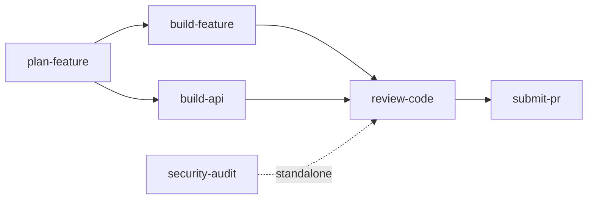

# Skills Reference

Detailed documentation for each skill in the Agent Council package. For installation and quick start, see [README.md](../README.md).

## Pipeline Overview



Each skill owns a single phase and hands off to the next. Skills never cross their scope boundary — `build-feature` commits code but never creates a PR, `review-code` reviews and fixes but never pushes.

---

## plan-feature

**Purpose**: Take a feature idea through critical analysis and two council reviews to produce an approved implementation plan with decision records.

**When to use**: Starting any new feature work. Run this before `build-feature` or `build-api`.

**What it does**:

1. Gathers feature context — what, who, why, constraints
2. Runs critical analysis — stress-tests assumptions, asks pointed questions, makes recommendations
3. Activates the **Product Council** (6 members) — evaluates strategic fit, priority, and user value
4. Defines lean scope — MVP boundaries, deferred work, feature flags, success metrics
5. Activates the **Feature Council** (4 members) — produces a technical task breakdown
6. Generates a decision record in `docs/decisions/`
7. Creates a feature branch and commits the decision record
8. Creates GitHub issue(s) with the full implementation plan

**Councils activated**:

| Council | Members | What it evaluates |
|---------|---------|-------------------|
| Product | Product Strategist (Lead), Lean Delivery Lead, Design Lead, Business Ops Lead, Principal Engineer, Frontend Specialist | Strategic fit, scope, priority, user value |
| Feature | Principal Engineer (Lead), Frontend Specialist, Backend Specialist, QA Lead | Technical breakdown, risks, implementation approach |

**Outputs**:

- Decision record at `docs/decisions/NNN-<feature-slug>.md`
- Feature branch (`feature/<feature-slug>`)
- GitHub issue(s) with implementation plan, council votes, and task checkboxes

**Compatibility**:

| Agent | Support | Notes |
|-------|---------|-------|
| Claude Code | Full | Slash command, parallel council via Task subagents |
| Cursor | Partial | Load SKILL.md as context, run steps manually |
| Other agents | Manual | Follow the step-by-step workflow |

**Next step**: `/build-feature <issue-number>` or `/build-api`

<details>
<summary>Example output</summary>

The skill produces a GitHub issue like:

```
Title: Implement user notification preferences

## Implementation Plan
### Database
- [ ] Add notification_preferences table with user_id FK
- [ ] Add preference_type enum (email, push, in-app)

### Backend
- [ ] Create notification preferences service
- [ ] Add CRUD endpoints for preferences
- [ ] Add preference check to notification dispatch

### Frontend
- [ ] Create preferences settings page
- [ ] Add toggle components for each channel
- [ ] Wire to API with optimistic updates

### Testing
- [ ] Unit tests for preference service
- [ ] Integration tests for API endpoints
- [ ] E2E test for preference toggle flow

## Council Votes
Product Council: Approved (6/6)
Feature Council: Approved (4/4)
```

</details>

---

## build-feature

**Purpose**: Execute a full-stack feature implementation across database, backend, frontend, and testing layers following an approved plan.

**When to use**: After `plan-feature` has produced an approved implementation plan, or when you have a clear set of tasks to implement across the stack.

**What it does**:

1. Loads the implementation plan from a GitHub issue, decision record, or user description
2. Implements the **database layer** — schema changes, migrations (checkpoint for approval)
3. Implements the **backend** — types, services, API layer, tests (checkpoint on API contract)
4. Implements the **frontend** — components, state, routing, API integration, tests (checkpoint)
5. Writes **end-to-end tests** for critical user flows
6. Runs self-review — type check, lint, format, all tests
7. Updates documentation if the feature changes setup or tech stack
8. Commits with conventional commit format (checkpoint for approval)
9. Tracks any deferred work as GitHub issues

**Councils activated**: None — relies on the plan already produced by `plan-feature`.

**Outputs**:

- Committed code across all layers (database, backend, frontend, tests)
- Conventional commits (`feat(db):`, `feat(api):`, `feat(web):`, `test:`)
- GitHub issue comment marking progress
- Deferred-work issues (if applicable)

**Compatibility**:

| Agent | Support | Notes |
|-------|---------|-------|
| Claude Code | Full | Reads issue via `gh`, commits, comments on issues |
| Cursor | Partial | Follow steps manually, run commands in terminal |
| Other agents | Manual | Follow the step-by-step workflow |

> [!NOTE]
> This skill requires a `## Tech Stack` section in your project's `AGENTS.md`. If not defined, the skill will stop and ask you to provide it. See [CUSTOMIZATION.md](CUSTOMIZATION.md) for details.

**Next step**: `/review-code`

---

## build-api

**Purpose**: Build backend API endpoints, services, and database changes. Activates the Architecture Council for significant API decisions.

**When to use**: Backend-only work — new API routes, business logic, database schema changes, or microservice patterns.

**What it does**:

1. Defines API requirements from a decision record or user description
2. Designs the full API contract — endpoints, types, validation, errors, auth
3. Optionally activates the **Architecture Council** for significant API decisions (checkpoint)
4. Implements the **database layer** if schema changes are needed (checkpoint)
5. Implements **backend** — types, repository layer, services, controllers, middleware
6. Writes **tests** — unit, integration, validation (>80% coverage target)
7. Generates or updates API documentation
8. Runs self-review — type check, lint, format, all tests
9. Updates documentation if the change affects setup or tech stack
10. Commits with conventional format

**Councils activated** (conditional):

| Council | Members | When activated |
|---------|---------|----------------|
| Architecture | Principal Engineer, Platform Engineer, Security Engineer, Backend Specialist | Significant API decisions — new resource types, breaking changes, new architectural patterns |

**Outputs**:

- Committed backend code (types, services, controllers, middleware, tests)
- API documentation updates
- Conventional commits (`feat(api):`)

**Compatibility**:

| Agent | Support | Notes |
|-------|---------|-------|
| Claude Code | Full | Parallel council via Task subagents, `gh` integration |
| Cursor | Partial | Follow steps manually |
| Other agents | Manual | Follow the step-by-step workflow |

> [!NOTE]
> This skill requires a `## Tech Stack` section in your project's `AGENTS.md`. See [CUSTOMIZATION.md](CUSTOMIZATION.md).

**Next step**: `/review-code`

---

## review-code

**Purpose**: Run a comprehensive, multi-perspective code review with automated security scanning and a 4-member Review Council.

**When to use**: Before creating a pull request, or any time you want a thorough review of your changes.

**What it does**:

1. Analyzes all changes on the current branch relative to main
2. Runs **formatting and lint checks** — auto-fixes mechanical issues
3. Runs **automated SAST scanning** — injection, XSS, CSRF, secrets, auth, CVEs
4. Runs **accessibility audit** if frontend files changed — WCAG, ARIA, keyboard nav
5. Activates the **Review Council** (4 members) — each member reviews from their perspective
6. Presents a **consolidated review report** organized by severity (checkpoint)
7. Applies fixes the user approves, re-runs checks to verify each (checkpoint)
8. Commits fixes with conventional format
9. Tracks deferred findings as GitHub issues

**Councils activated**:

| Council | Members | What they review |
|---------|---------|------------------|
| Review | Security Engineer (Lead), QA Lead, DevX Engineer, Domain Specialist* | Security, testing, documentation, domain patterns |

*Domain Specialist is Frontend Specialist, Backend Specialist, or both — selected based on which files changed.

**Outputs**:

- Consolidated review report with severity-organized findings and council votes
- Committed fixes (`fix(security):`, `refactor:`, etc.)
- Deferred-finding issues (if applicable)

**Compatibility**:

| Agent | Support | Notes |
|-------|---------|-------|
| Claude Code | Full | Parallel council via Task subagents, automated scanning |
| Cursor | Partial | Follow checklist manually, run checks in terminal |
| Other agents | Manual | Follow the step-by-step workflow |

**Next step**: `/submit-pr`

<details>
<summary>Example review report</summary>

```
## Review Council Report

### Critical / Blocking Issues
None

### High Priority Issues
H1: SQL injection risk in search endpoint (Security Engineer — Block)
    File: src/api/search.ts:42
    Fix: Use parameterized query instead of string interpolation

### Medium Priority Issues
M1: Missing test coverage for error path (QA Lead — Concern)
    File: src/services/user.ts:88
    Fix: Add test for invalid input handling

### Low Priority / Suggestions
L1: Consider adding JSDoc to exported function (DevX Engineer)

### Council Votes
- Security Engineer: Concern (H1 must be fixed)
- QA Lead: Concern (M1 recommended)
- DevX Engineer: Approve
- Backend Specialist: Approve

Overall: Needs Changes (fix H1, recommended M1)
```

</details>

---

## submit-pr

**Purpose**: Create a well-documented pull request with quality checks, conventional formatting, and CI monitoring.

**When to use**: When your feature branch is ready to merge to main, typically after `review-code`.

**What it does**:

1. Runs **pre-submission checks** — confirms feature branch, rebases on main, runs type-check/lint/format/test/build, security scan
2. Analyzes changes — commits, file diff, type of change, related issues
3. Optionally activates the **Deployment Council** for production-impacting changes (checkpoint)
4. Generates a **PR description** from the PR template — title, body, checklist, changelog entry (checkpoint)
5. Pushes the branch and creates the PR
6. **Monitors CI** — watches the pipeline, auto-fixes formatting failures, checkpoints for other failures
7. Presents a post-PR summary with the PR URL and CI status

**Councils activated** (conditional):

| Council | Members | When activated |
|---------|---------|----------------|
| Deployment | Platform Engineer (Lead), Security Engineer, QA Lead | Database migrations, infrastructure changes, env var changes, auth code changes, CI/CD modifications |

**Outputs**:

- Pushed feature branch
- GitHub pull request with full description
- CI monitoring result
- Optional changelog entry

**Compatibility**:

| Agent | Support | Notes |
|-------|---------|-------|
| Claude Code | Full | `gh pr create`, `gh run watch`, automated CI monitoring |
| Cursor | Partial | Create PR manually, monitor CI in browser |
| Other agents | Manual | Follow the checklist, use platform tools |

**Next step**: None — this is the end of the pipeline. After merge, run `/plan-feature` for the next feature.

---

## security-audit

**Purpose**: Run a comprehensive security audit combining SAST scanning, STRIDE threat modeling, and attack tree analysis.

**When to use**: Before major releases, after security-sensitive changes, or on a regular cadence. Can audit the full codebase or specific directories.

**What it does**:

1. Defines audit scope — full codebase or specific area, trigger, focus areas (checkpoint)
2. Runs **automated SAST scanning** — injection, XSS, CSRF, auth, secrets, CVEs, deserialization, prototype pollution
3. Performs **security hardening review** — HTTP headers, API security, auth/authz, data protection, infrastructure
4. Conducts **STRIDE threat modeling** — Spoofing, Tampering, Repudiation, Information Disclosure, Denial of Service, Elevation of Privilege
5. Builds **attack trees** for the top 3 highest-risk threats — goals, paths, sub-goals, resources, defenses, weakest links
6. Activates the **Architecture Council** (security subset, 3 members) — validates findings, assesses posture, identifies systemic patterns
7. Presents the **full audit report** — executive summary, findings by severity, threat model, recommended actions (checkpoint)
8. Optionally **remediates** — fixes in priority order, re-scans, commits

**Councils activated**:

| Council | Members | What they evaluate |
|---------|---------|-------------------|
| Architecture (subset) | Security Engineer (Lead), Principal Engineer, Backend Specialist | Findings validation, security posture, systemic patterns |

**Outputs**:

- Structured security audit report (executive summary, SAST findings, STRIDE table, attack trees, recommendations)
- Optional committed security fixes (`fix(security):`)

**Compatibility**:

| Agent | Support | Notes |
|-------|---------|-------|
| Claude Code | Full | Parallel council, automated scanning, remediation |
| Cursor | Partial | Follow checklist manually, apply fixes in editor |
| Other agents | Manual | Follow the step-by-step workflow |

**Next step**: `/review-code` (if code changed), `/plan-feature` (new feature), or none (audit-only).

<details>
<summary>Example STRIDE entry</summary>

```
## Threat: Session Hijacking (Spoofing)

- Likelihood: Medium
- Impact: High
- Risk Score: High
- Current Mitigations: HTTPS, HttpOnly cookies, session expiry
- Gaps: No session rotation on privilege change, no concurrent session limits
- Recommended: Add session rotation after login, limit to 3 concurrent sessions
```

</details>
