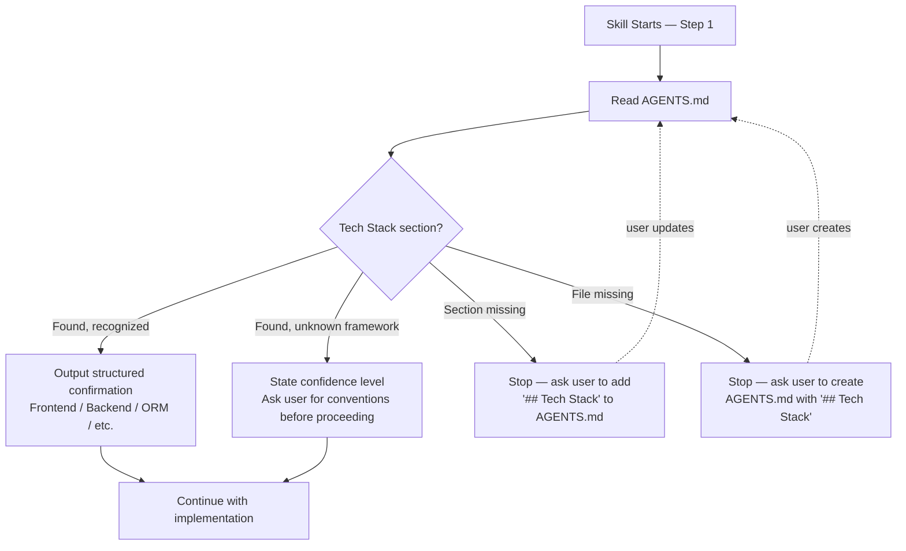

# Decision 002: Refine Tech Stack Detection in build-feature and build-api

- **Date**: 2026-02-20
- **Council**: Product Council + Feature Council
- **Status**: Approved

## Question

How should `build-feature` and `build-api` communicate tech stack detection from `AGENTS.md` to the user, and how should they handle missing or unfamiliar tech stacks?

## Context

- **Current situation**: Both skills are already written with generic "your project's framework" language throughout their workflow steps. However, the `[!WARNING]` tech stack blocks at the top of each skill show a single complete, concrete example stack — React/Express/Prisma/Tailwind for `build-feature`, Express/Prisma/Zod for `build-api`. LLMs weight concrete instructional examples heavily, creating a risk that agents anchor on these specific technologies even when `AGENTS.md` specifies a different stack.
- **Requirements**: (1) Eliminate example anchoring in the warning blocks. (2) Make tech stack detection explicit — the agent should read and confirm what it found in AGENTS.md before beginning any implementation. (3) Handle edge cases: missing AGENTS.md, AGENTS.md without a tech stack section, and recognized vs. unrecognized frameworks.
- **Constraints**: Documentation-only change. Must not alter the skill's checkpoint sequence or scope boundary. Must pass `scripts/build.sh --check` (drift detection). `setup-design-system` is out of scope — it no longer exists in the canonical skills directory. The Phase 2 external-user-feedback gate has been waived by the project owner given the narrowed scope.
- **Options considered**:

| Option | Pros | Cons |
|--------|------|------|
| **Multi-ecosystem example block** | Demonstrates range; instructive; concrete | Still provides anchoring examples, just more of them |
| **Categorical placeholder format** | Eliminates anchoring entirely | Reads like a blank form; loses instructional value |
| **Drop the example entirely** | No anchoring risk | Removes guidance on what AGENTS.md should contain |

The council recommended a two-ecosystem contrast (TypeScript + Python) as the best balance between instructive and non-anchoring.

## Council Votes

Product Council — 6 members (click to expand)

### Product Strategist

- **Vote**: Approve
- **Rationale**: Anchoring on example stacks is a real usability gap that affects all users whose stacks don't match the examples. The explicit echo step closes the feedback loop and builds user confidence that detection actually ran.
- **Recommendations**: Prioritize the echo step; frame unknown-stack handling as "ask rather than guess."

### Lean Delivery Lead

- **Vote**: Approve
- **Rationale**: All changes are documentation edits — no code, no dependencies, no infrastructure. Single PR, single increment, zero risk of delay or regression.
- **Recommendations**: Three changes, one PR. Do not split. Two-stack example preferred over abstract placeholders.

### Design Lead

- **Vote**: Approve
- **Rationale**: A concrete example carries more weight than generic surrounding language for LLMs. Diversifying the example sends a clearer signal about intent. The echo step makes skill behavior observable and debuggable.
- **Recommendations**: Echo output should be a structured key-value block, not prose. Consistent voice with the rest of the skill set.

### Business Operations Lead

- **Vote**: Approve
- **Rationale**: Zero cost, favorable ROI — reduces friction for non-JavaScript users and makes the stack-agnostic claim credible.
- **Recommendations**: Document as a `fix` entry in CHANGELOG.

### Principal Engineer

- **Vote**: Approve (Minor Concern noted)
- **Rationale**: Architecturally sound. Consistent with the AGENTS.md-first design philosophy. The explicit echo step makes implicit behavior explicit.
- **Concern**: Unknown-stack guidance must direct the agent to surface and confirm, not silently substitute a default. The failure mode of silent wrong assumptions is worse than a noisy confirmation request.

### Frontend Specialist

- **Vote**: Approve
- **Rationale**: The single-stack example is a UX bug — it trains agent attention toward one output pattern. Two examples from different domains is sufficient to demonstrate range.
- **Recommendations**: Echo output format should be scannable. Both skills should have identical detection logic after the change.

Feature Council — 4 members (click to expand)

### Principal Engineer (Lead)

- **Vote**: Approve
- **Rationale**: LLM anchoring on instructional examples is a documented failure mode. The three proposed changes are well-scoped, independent improvements that fit cleanly into the existing skill structure.
- **Recommendations**: Parse-and-echo sub-step must be mandatory, not conditional. Unknown-stack handling should state confidence level and ask for confirmation before generating framework-specific code.

### Frontend Specialist

- **Vote**: Approve
- **Rationale**: A developer who gets React scaffolding when they use FastAPI will immediately lose trust in the skill. The parse-and-echo step creates an explicit confirmation moment that builds trust before the agent acts.
- **Recommendations**: Format echo output as a structured summary scannable at a glance.

### Backend Specialist

- **Vote**: Approve with Concern
- **Rationale**: Changes slot cleanly into existing workflow without disrupting the checkpoint sequence.
- **Concern**: Unknown-stack guidance must live inside the parse-and-echo sub-step as a conditional branch — not as a separate top-level warning block that agents may process and dismiss before reaching the detection point.
- **Recommendations**: Position unknown-stack handling at the moment of detection. For `build-api`, confirm the sub-step is positioned before the API style discussion in Step 1.

### QA Lead

- **Vote**: Approve with Concern
- **Rationale**: Build pipeline validation (`build.sh` + `--check`) is the correct mechanism. Documentation-only changes simplify the validation surface considerably.
- **Concern**: The parse-and-echo sub-step must explicitly handle three AGENTS.md states, not just two: (1) exists with tech stack, (2) exists without tech stack section, (3) does not exist at all.
- **Recommendations**: Spot-check generated `skills/` output after build, not just the `--check` diff.

## Decision

- **Status**: Approved
- **Choice**: Refine both skills with a two-ecosystem example block, an explicit Tech Stack Detection sub-step (handling all three AGENTS.md states), and unknown-framework guidance as a conditional branch inside the detection step.
- **Consensus**: All 10 council members approved. Two Approve with Concern votes from the Feature Council were incorporated as implementation constraints (placement of unknown-stack guidance, three-state AGENTS.md handling).

## Rationale Summary

Both skills were already using generic "your project's framework" language, but the instructional example blocks at the top undermined that genericism by showing a single concrete stack. LLMs weight concrete examples in prompts more heavily than surrounding generic language — this is a known inference behavior, not a theoretical risk. A user with a Python or Ruby project following these skills would likely receive TypeScript-flavored scaffolding suggestions despite their AGENTS.md specifying otherwise.

The explicit Tech Stack Detection sub-step addresses the second gap: there was previously no moment where the skill forced the agent to pause, confirm what it found in AGENTS.md, and surface that information to the user. This made tech detection invisible and unverifiable. The new sub-step creates an observable confirmation point at the start of implementation — before any code is generated — that the user can validate in under 5 seconds.

The three-state AGENTS.md handling (exists with stack, exists without stack section, missing entirely) closes the edge case gap identified by the QA Lead. Without explicit guidance for all three states, agents will improvise inconsistently on the same project across different sessions.

**Key factors**:

- Concrete examples in LLM instructions anchor output toward those examples even when surrounding language is generic
- Observable confirmation steps build user trust more effectively than invisible detection
- Unknown-stack handling must be a conditional branch at the point of detection, not a front-loaded warning that agents dismiss once before executing

## Action Items

- [ ] Refactor `[!WARNING]` tech stack example block in `canonical/skills/build-feature/SKILL.md` — replace single-stack example with two-ecosystem contrast (TypeScript/Express + Python/FastAPI)
- [ ] Add Tech Stack Detection sub-step to `build-feature` Step 1 — after branch selection, before feature branch verification; handles all three AGENTS.md states; unknown-framework branch as conditional inside detection step
- [ ] Verify Step 7 AGENTS.md update checkpoint in `build-feature` is internally consistent with new Step 1 detection language
- [ ] Refactor `[!WARNING]` tech stack example block in `canonical/skills/build-api/SKILL.md` — same two-ecosystem approach
- [ ] Add Tech Stack Detection sub-step to `build-api` Step 1 — positioned before API style discussion; same three-state handling
- [ ] Run `scripts/build.sh` and verify with `scripts/build.sh --check`
- [ ] Update issue #6 title to remove `setup-design-system`

## Timeline

- **Decision Date**: 2026-02-20
- **Implementation Start**: 2026-02-20
- **Expected Completion**: 2026-02-21 (Small complexity, documentation-only)
- **Review Checkpoint**: After first external user report on non-JavaScript stack compatibility

## Follow-up

Revisit once at least one external user reports using the skills with a non-TypeScript stack. The key validation question: does the echo step appear as expected, and does the two-ecosystem example block prevent framework anchoring in practice? If the AGENTS.md approach proves insufficient for code-generation tasks, evaluate flavor modules at that point.

## References

- [Issue #6](https://github.com/andrewvaughan/agent-council/issues/6) — Phase 2: Transform implementation skills
- [Issue #16](https://github.com/andrewvaughan/agent-council/issues/16) — Decouple wshobson/agents plugin references (related; `build-api` Step 2 contains plugin consult references)
- [Decision 001](001-example-architecture-decision.md) — Example decision record template
- [AGENTS.md](../../AGENTS.md) — Agent council reference and tech stack declaration format
- [canonical/skills/build-feature/SKILL.md](../../canonical/skills/build-feature/SKILL.md)
- [canonical/skills/build-api/SKILL.md](../../canonical/skills/build-api/SKILL.md)
