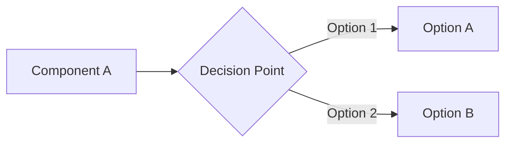

# Decision NNN: [Short Title]

- **Date**: [YYYY-MM-DD]
- **Council**: [Council Name]
- **Status**: [Approved / Needs Changes / Blocked]

## Question

[What decision needs to be made? Frame as a clear, specific question.]

## Context

- **Current situation**: [Describe what exists now]
- **Requirements**: [What we need to achieve]
- **Constraints**: [Time, budget, technical limitations]
- **Options considered**: [Option A, Option B, and why these options]

<!-- Include a mermaid diagram when the decision involves multiple components or data flows -->

## Council Votes

### [Council Member Role] (Lead)

- **Vote**: [Approve / Concern / Block]
- **Rationale**: [2-3 sentences explaining the vote]
- **Recommendations**: [Changes needed, trade-offs to consider]

### [Council Member Role]

- **Vote**: [Approve / Concern / Block]
- **Rationale**: [Assessment from this perspective]
- **Recommendations**: [Specific suggestions]

<!-- Add additional council members as needed -->

## Decision

- **Status**: [Approved / Needs Changes / Blocked]
- **Choice**: [The selected option]
- **Consensus**: [Summary of agreement/disagreement across council members]

## Rationale Summary

[2-3 paragraphs synthesizing the council's perspectives into a cohesive decision rationale]

**Key factors**:

- [Factor 1 from multiple perspectives]
- [Factor 2 that emerged as critical]
- [Trade-offs accepted and why]

## Action Items

- [ ] [Specific action with clear acceptance criteria]
- [ ] [Implementation task]
- [ ] [Documentation or testing requirement]
- [ ] [Follow-up review or validation]

## Timeline

- **Decision Date**: [YYYY-MM-DD]
- **Implementation Start**: [Date]
- **Expected Completion**: [Date]
- **Review Checkpoint**: [Date for follow-up evaluation]

## Follow-up

[What needs to be validated after implementation? When should we revisit this decision?]

## References

- [Link to relevant documentation]
- [Link to research or comparison]
- [Link to related decisions]
